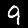

# Simple implementation of Autoencoder in mxnet and scala.

##This project includes an implementation of Autoencoder and a test configuration using the MNIST data set.

For more information about autoencoder you can visit [Wikipedia Autoencoder](https://en.wikipedia.org/wiki/Autoencoder)

For more information about the dataset and download the test data please refer to the [MNIST database page](http://yann.lecun.com/exdb/mnist/).

Here are some samples of the test image and the image decoded by the test implementation:

| Test Image | Decoded Image |
| ------------- | ------------- |
|   |  |
|   |  |
|   |  |
|   |  |
|   |  |
|   |  |
|   |  |
|   |  |
|   |  |
|   |  |
